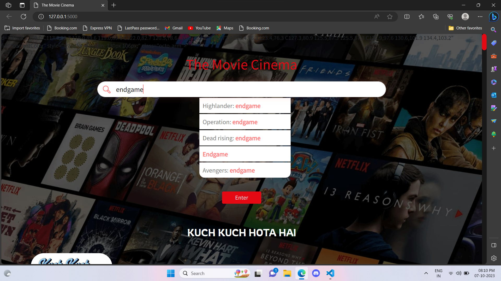

# 🎬 CineMind-ML
  
**[CineMind-ML](https://github.com/jatinAB/CineMind-ML)** is an **AI-powered movie recommendation system** built using **Flask** and **Machine Learning**.  
It recommends movies based on user preferences, similarity scores, and popularity metrics using **content-based filtering**, **collaborative filtering**, and **sentiment analysis** on IMDb reviews.

The app fetches real-time movie data such as **overview, genre, rating, runtime, top cast, and posters** using the **TMDB API**, while also performing **web scraping** to extract user reviews from IMDb for **sentiment analysis** using `BeautifulSoup`.

If a movie doesn’t appear in auto-suggestions, simply type the full name and hit **Enter** — CineMind-ML will handle it for you, even with small typos!  

---

## ⚙️ Features  

✅ Personalized movie recommendations using ML models  
✅ Real-time data fetched from TMDB API  
✅ Sentiment analysis on IMDb reviews  
✅ Interactive and responsive web interface  
✅ Supports fuzzy search for partial or misspelled movie names  

---

## 🧩 How to Run the Project  

1️⃣ **Clone the repository:**  
```bash
git clone https://github.com/jatinAB/CineMind-ML.git
cd CineMind-ML
````

2️⃣ **Install dependencies:**

```bash
pip install -r requirements.txt
```

3️⃣ **Set up your TMDB API key:**

* Replace `YOUR_API_KEY` inside `static/recommend.js` (line 2).

4️⃣ **Run the Flask app:**

```bash
python main.py
```

5️⃣ **Open in browser:**
Visit `http://127.0.0.1:5000/`

🎉 That’s it — your ML-powered movie recommender is live!

---

## 🔑 How to Get a TMDB API Key

1. Visit [The Movie Database](https://www.themoviedb.org/) and create an account.
2. Navigate to your **Account Settings → API** section.
3. Fill out the application form for a free API key.
4. Use `"NA"` if asked for a website URL.
5. Once approved, you’ll find your **API Key (v3 auth)** under the API section.

---

## 🧠 Machine Learning Techniques

* **Content-Based Filtering:** Recommends movies similar to those the user liked based on metadata and cosine similarity.
* **Collaborative Filtering:** Suggests movies by learning from user-item interaction patterns.
* **Sentiment Analysis:** Classifies IMDb reviews into positive or negative using text mining and NLP.

---

## 🧾 Datasets Used

1. [IMDB 5000 Movie Dataset](https://www.kaggle.com/carolzhangdc/imdb-5000-movie-dataset)
2. [The Movies Dataset](https://www.kaggle.com/rounakbanik/the-movies-dataset)
3. [List of American Films – 2018](https://en.wikipedia.org/wiki/List_of_American_films_of_2018)
4. [List of American Films – 2019](https://en.wikipedia.org/wiki/List_of_American_films_of_2019)
5. [List of American Films – 2020](https://en.wikipedia.org/wiki/List_of_American_films_of_2020)

---

## 📸 Screenshots

### 🔍 Search Page

<p align="center">
  
</p>

### 🎬 Search Result

<p align="center">
  
</p>

### 🎬 Movie details

<p align="center">
  
</p>

### 🎬 Cast Info
<p align="center">
  
</p>

### 🎬 Movie Reviews

<p align="center">
  
</p>

### 🎬 Movie Recommendations

<p align="center">
  
</p>
---

## 🧰 Tech Stack

| Category               | Technologies                     |
| ---------------------- | -------------------------------- |
| **Frontend**           | HTML, CSS, JavaScript            |
| **Backend**            | Flask (Python)                   |
| **Machine Learning**   | Scikit-learn, Pandas, NumPy, NLP |
| **APIs**               | TMDB API                         |
| **Web Scraping**       | BeautifulSoup4                   |
| **Data Visualization** | Matplotlib, Seaborn              |

---

## 🧑‍💻 Author

**Jatin Bandekar**
📧 [bandekarjatin02@gmail.com](mailto:bandekarjatin02@gmail.com)
🔗 [GitHub Profile](https://github.com/jatinAB)

---

## ⭐ Acknowledgments

* [TMDB API](https://www.themoviedb.org/documentation/api)
* [IMDB](https://www.imdb.com/)
* [Scikit-learn](https://scikit-learn.org/stable/)

